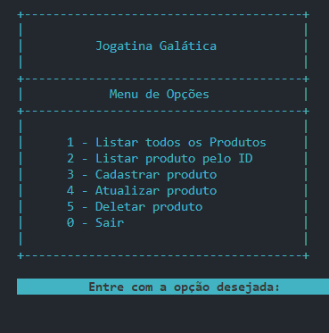

# Projeto Final Bloco 01

## Bootcamp - JavaScript Full Stack [Generation Brasil](https://brazil.generation.org/)

### Objetivo:

Implementar um Sistema de Comércio Eletrônico(e-commerce), utilizando conceitos na linguagem TypeScript.

## Técnologias

- TypeScript
- Node.js

## Conhecimentos que deverão ser aplicados no projeto:

### Primeira Etapa - Construção do Projeto e Menu

- Crie um Projeto com o nome projeto_final_bloco_01.
- Adicione o arquivo .gitignore padrão do TypeScript na pasta raíz do projeto
- Crie uma nova Branch, chamada 01_Menu
- Desenvolva o Menu do seu projeto, utilizando os seguintes conteúdos:
  - Variáveis
  - Entrada e saída de dados.
  - Laços Condicionais.
  - Laços de Repetição.
- O Menu deverá exibir as seguintes opções:
  - Listar todos os Produtos
  - Listar Produto pelo ID
  - Cadastrar Produto
  - Atualizar Produto
  - Deletar Produto
  - Sair

- Atualize a Branch 01_Menu com o conteúdo desenvolvido até aqui.

### Segunda Etapa — Construção das Classes Model e Interface Repository

- Crie uma nova Branch, chamada 02_Model_Repository
Desenvolva as Classes Principal e Estendida (Model), e a Interface Repository, utilizando os seguintes conteúdos:
  - Métodos e Modificadores de acesso.
  - Classes, Atributos e Objetos.
  - Polimorfismo e Herança.
  - Classes Abstratas e Interfaces.
- Os Métodos que serão adicionados na Interface Repository são:
  - Listar todos os Produtos
  - Listar Produto pelo ID (código do produto)
  - Cadastrar Produto
  - Atualizar Produto
  - Deletar Produto

- Atualize a Branch 02_Model_Repository com o conteúdo desenvolvido até aqui.

### Terceira Etapa — Construção da Classe Controller e Métodos do CRUD

- Crie uma nova Branch, chamada 03_Controller
Desenvolva a Classe Controller do seu projeto, utilizando os seguintes conteúdos:
  - Collections.
- Na Classe Controller você deverá implementar todos os Métodos da Interface Repository
  - Atualize a Classe Menu, adicionando as respectivas entradas e dados e chamadas para os Métodos da Classe Controller em cada opção do Menu.

- Atualize a Branch 03_Controller com o conteúdo desenvolvido até aqui.

### Preview

